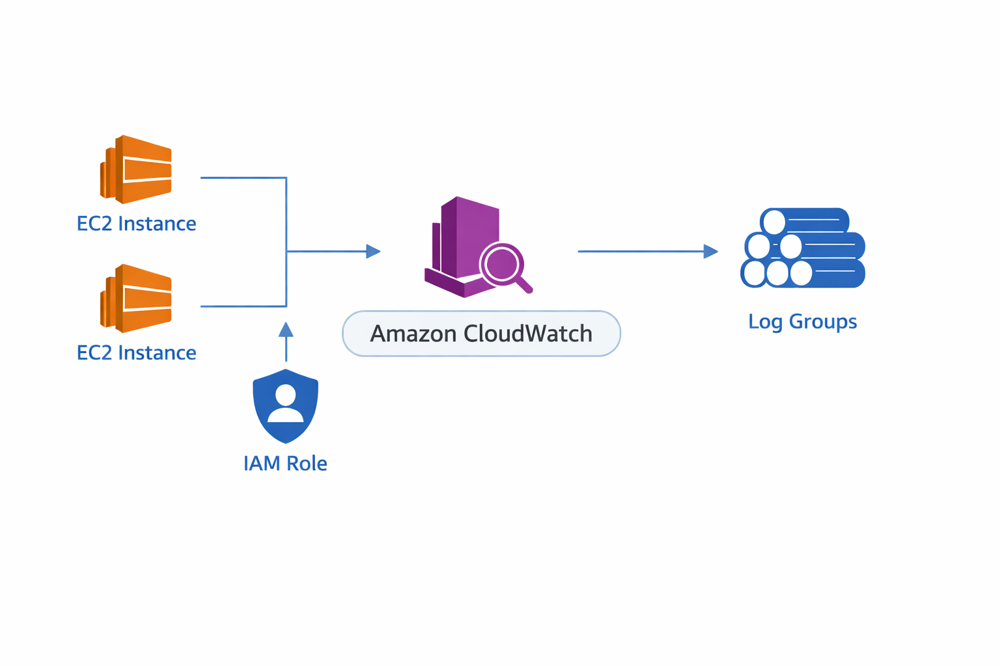

# Monitoring Module

This section handles logging and monitoring for the cloud environment.

## Architecture

## Description

This module uses AWS CloudWatch to collect logs and monitor system activity.  
It helps ensure visibility, auditing, and security across the infrastructure.

## Components
- CloudWatch Log Groups
- Log retention policies
- Centralized logging
